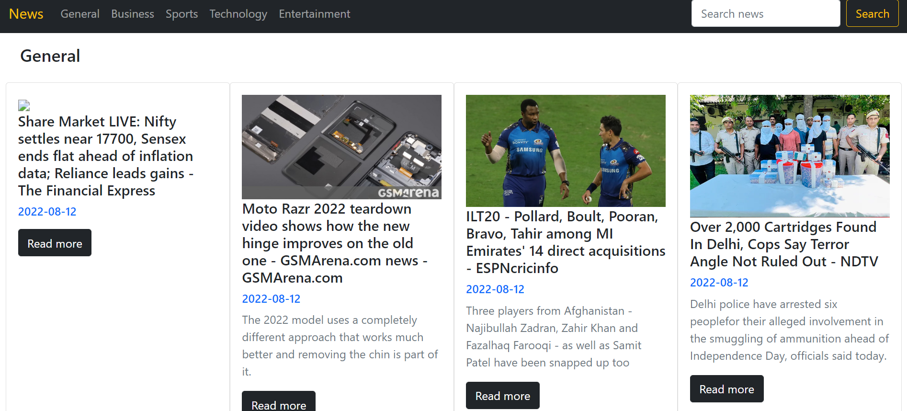
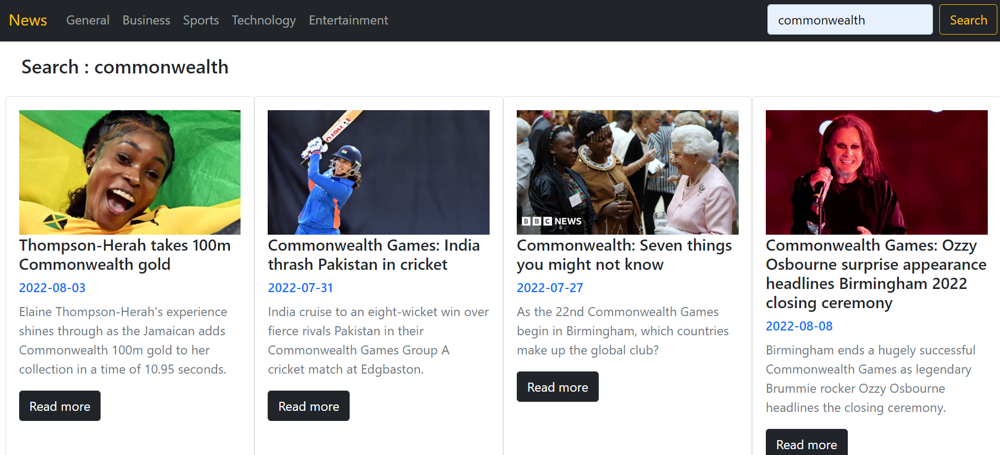

# News-Express

💠 ~*In this project we build the “News Website”. This website will use news API. The News API is a simple and easy-to-use API that returns JSON metadata for headlines and articles live all over the web right now. This website will show live news to the user, which will be displayed with the help of news API.*
---

News Sections in the webiste include :

1. General
2. Business
3. Sports
4. Technology
5. Entertainment

✔️ Results include thumbnail image, headline, date and link to view the full article.

Search for a news article by entering a keyword ;

💠 *Search results include thumbnail image, headline, date and link to view the full article.*
---

 A simple news website built using
 * HTML 
 * Bootstrap 
 * JAVASCRIPT
 * NEWS API
 
 
 ⭐ Learnt how to fetch public APIs in JavaScript using async and await functions.
 
 ⭐ Learnt how to use Javascript to develop dynamic HTML code.
 
 ⭐ Learnt how to find news on query.
 
 
 
 We are fetching data from (https://newsapi.org/).

✔️ Deployment on github, link :

✔️ Our website looks like :

---

---

---

Search results:

---
